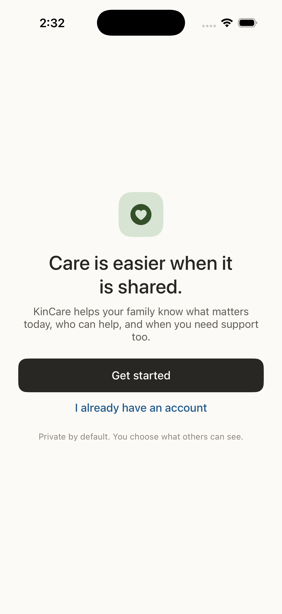
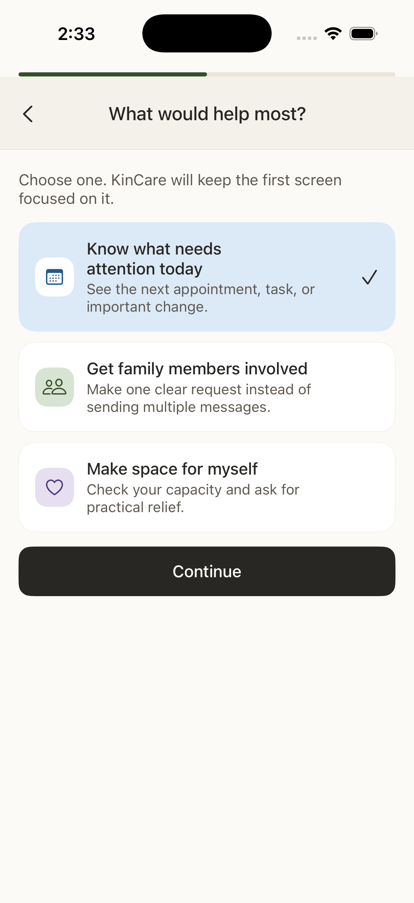
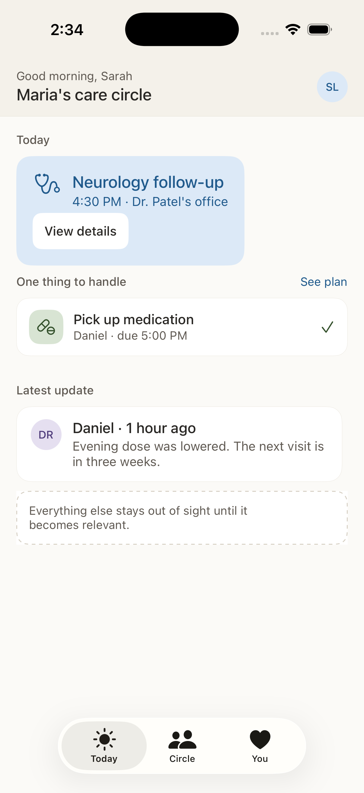
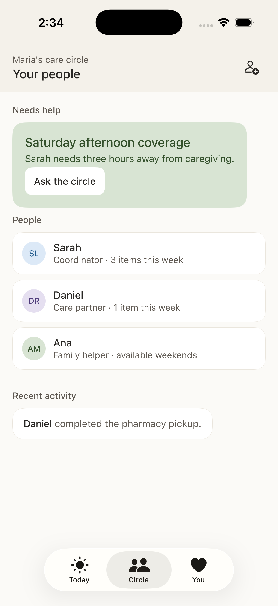
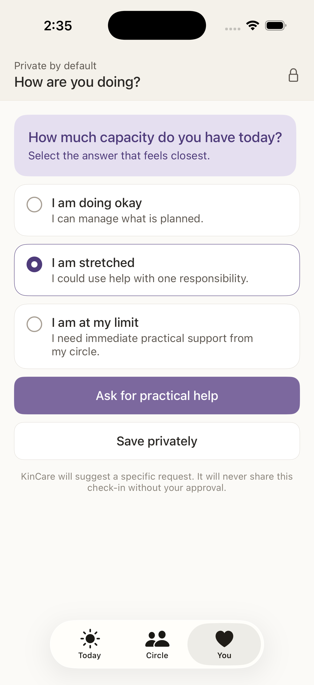

<p align="center">
  
</p>

> Submitted to the Kode with Klossy x Apple Mobile App Challenge. Due Jul 20, 2026. Awaiting results.

# KinCare

KinCare is an iOS app for coordinating care within a trusted circle. It helps families and helpers organize shared responsibilities, invite support, and stay focused on what matters today.


## Features

- Guided onboarding for new users
- Role selection for care recipients and helpers
- Circle creation and invitation flow
- Today view for current priorities
- Personal “You” area for user-specific context
- SwiftUI-first interface with reusable components and shared theme styling

## Project Structure

```text
KinCare/
├── KinCare/
│   ├── Assets.xcassets
│   ├── Components.swift
│   ├── KinCareApp.swift
│   ├── MainTabView.swift
│   ├── OnboardingFlow.swift
│   ├── Theme.swift
│   └── Views...
├── KinCareTests/
└── KinCareUITests/ 
```

## Screen Previews

<p align="center">
  
  
  
  
  
</p>
